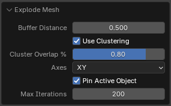

# Baking

## Explode Mesh

A baking-preparation operator that separates overlapping or intersecting geometry so meshes can be baked without nearby geometry interfering with the result.

The tool includes a clustering system that analyses object bounding boxes to keep related objects together.

This is particularly useful for matching high-resolution and low-resolution baking pairs. Objects with nearly identical spatial bounds can remain synchronized while the clusters are exploded away from surrounding geometry.

