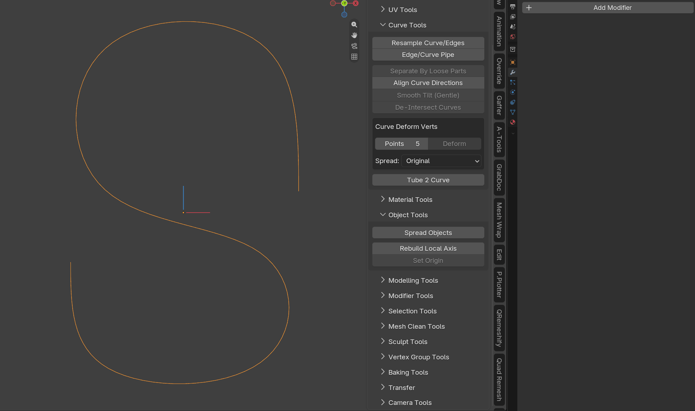
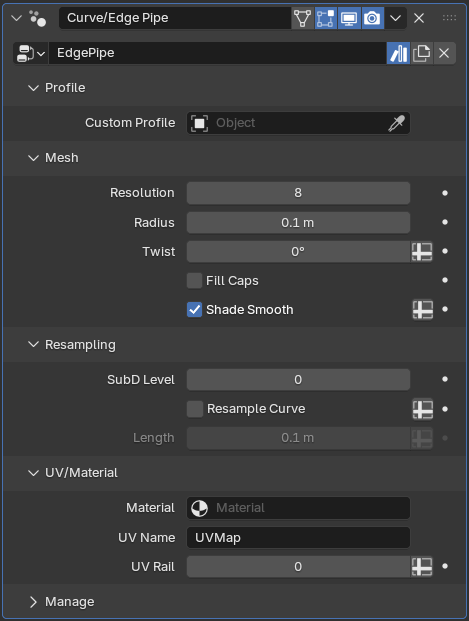
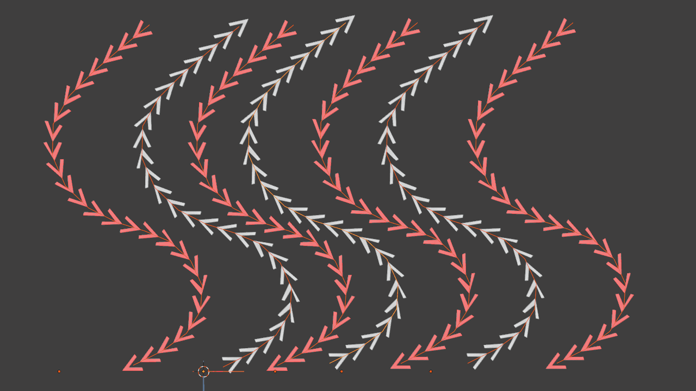
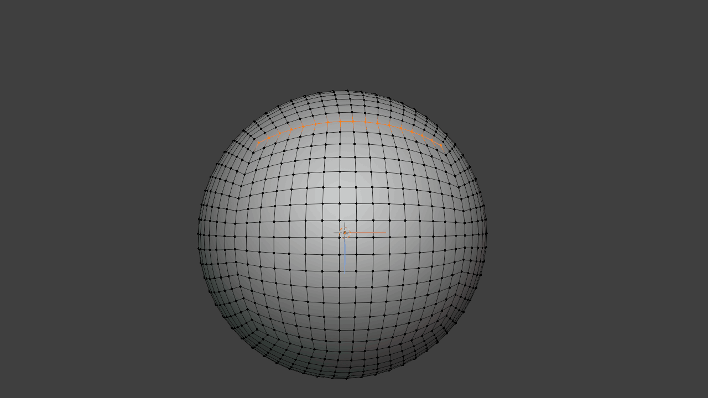
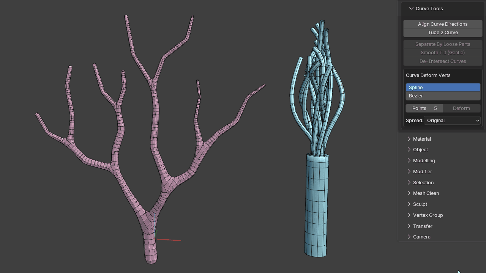
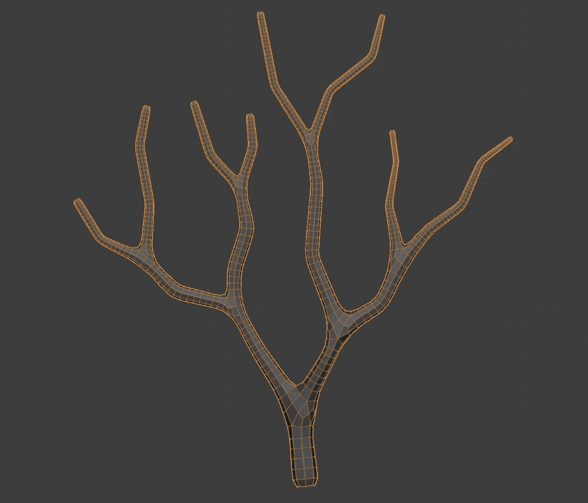

# Curve

Curve-based modelling, conversion and deformation utilities.

## Resample Curve/Edge

Adds a Geometry Nodes modifier that allows an edge or curve to be resampled through modifier controls.

## Edge/Curve Pipe

Adds a Geometry Nodes modifier that turns an edge or curve into a tube or pipe.

The generated pipe includes automatic UVs and can use a custom profile.

## Separate By Loose Parts

Separates curves by loose parts, similar to Blender's mesh **Separate by Loose Parts** workflow.

## Align Curve Direction

Attempts to make curves with a similar flow use the same curve direction. (Works in both edit and object mode)

## Smooth Tilt (Gentle)

A more sensitive alternative to Blender's built-in Smooth Tilt operator, designed to provide finer control over softening out the twists in curves.

## Curve Deform Verts

Quickly deform selected vertices along an editable curve with intuitive viewport controls.

Before running the operator you can choose between **Spline** and **Bezier** curve types. Bezier mode initializes its handles from the selected vertex chain so it follows the existing curvature as closely as possible at any control-point count. The endpoint handles are aligned to the original vertex-chain tangents, while the remaining handles are fitted against the source curvature. The handles can then be adjusted for more precise shaping.

You can dynamically increase or decrease the number of curve control points and change how vertices are distributed along the curve.

This is especially useful for hard-surface modelling when vertices need to follow a specific curvature.

Hotkeys:

- **M** = Change distribution method
- **+ / -** = Increase/Decrease curve points
- **S** = Scale the selected Bezier point handles
- **R** = Rotate the selected Bezier point handles by moving the mouse around the selected point, similar to Blender's viewport rotation

## Tube 2 Curve

Converts tube or pipe geometry back into a center curve.

  
  

