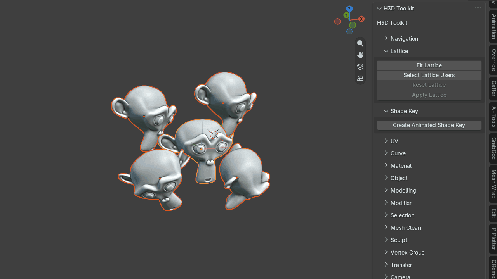
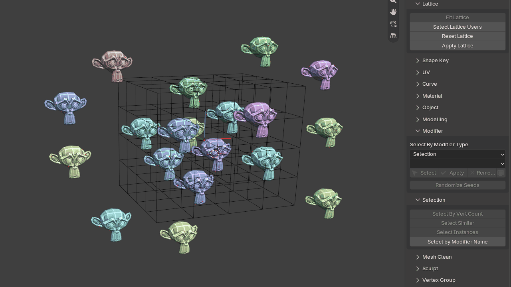
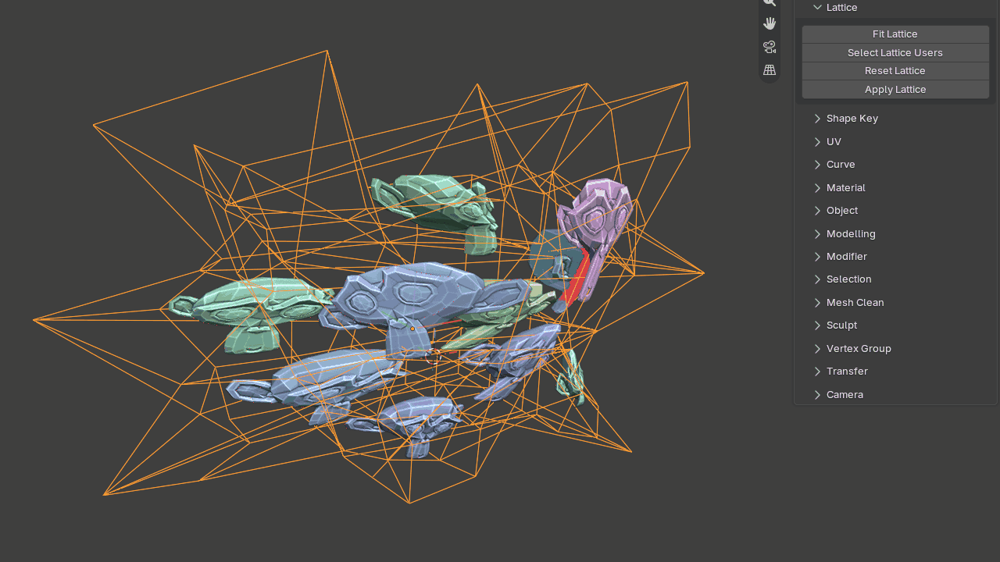
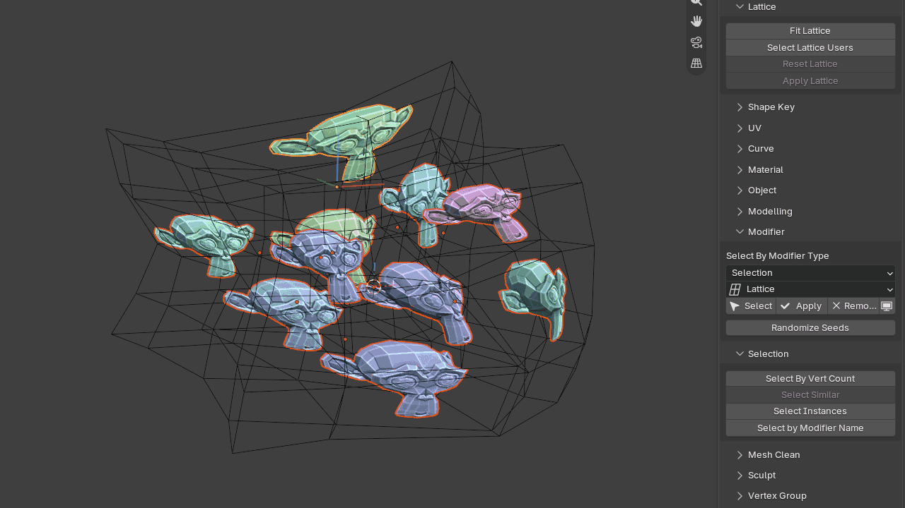

# Lattice

Tools for quickly creating and managing lattice-based deformation workflows.

## Fit Lattice

Fits a lattice around selected objects or components, aligning it to their local (active objects) orientation.

The orientation can be matched to either:

- the active object
- world space

{ .media-center .media-medium }

## Select Lattice Users

Select a lattice and run this operator to select all objects currently affected by that lattice.

{ .media-center .media-medium }

## Reset Lattice

Resets the selected lattice back to its default state.

{ .media-center .media-medium }

## Apply Lattice

Select a lattice and click Apply Lattice to apply the modifier for any objects using it.

{ .media-center .media-medium }
