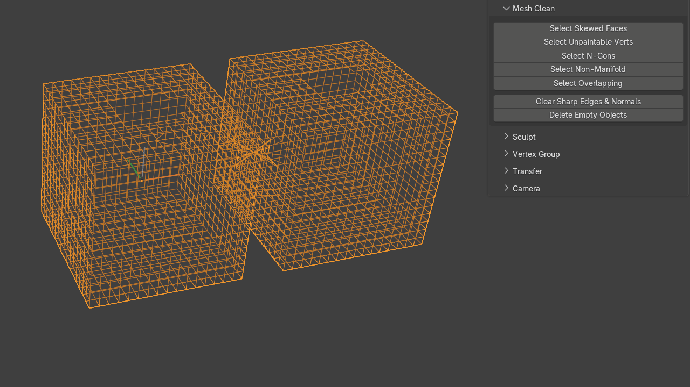

# Mesh Clean

Mesh cleanup and inspection tools.

!!! note
    These cleanup tools deselect non-problematic objects, enter Edit Mode on problematic objects, and highlight the detected issue for quick inspection.

## Select Skewed Faces

Selects faces that are extremely skewed and causing poor triangulation.

## Select Unpaintable Verts

Selects vertices that have only two edge neighbours.

An angle tolerance helps avoid selecting legitimate corner vertices.

## Select Ngons

Selects n-gons.

## Select Overlapping

Finds objects or components that are perfectly overlapping.

The operator supports both **Object** and **Component** modes.

When duplicates overlap, the tool aims to select the redundant geometry while leaving one copy unselected, making it possible to immediately delete the problem geometry.

{ .media-center .media-medium }

## Clear Sharp Edges & Normals

Removes imported sharp-edge and custom-normal data, leaving a soft-shaded mesh without custom normals.

## Delete Empty Objects

Deletes scene objects that contain no vertices, edges or faces.
