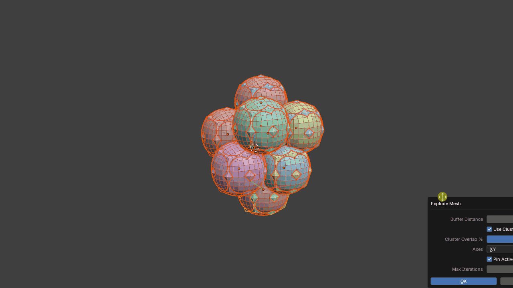
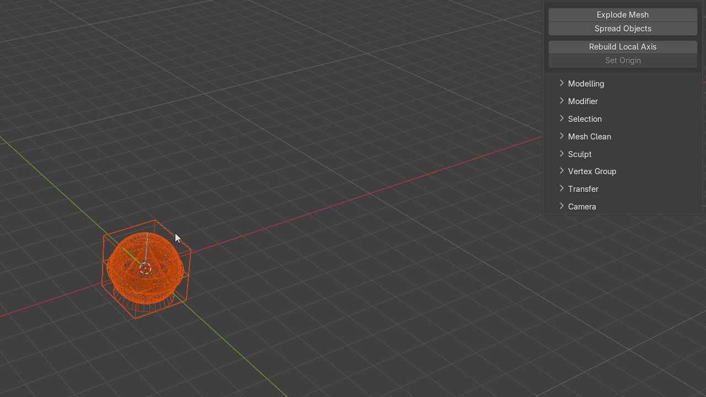
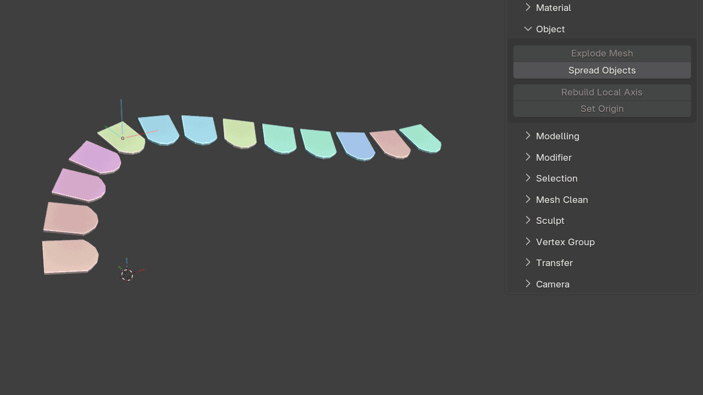

# Object

Object-level utilities for layout, baking preparation, local axes and origins.

## Explode Mesh

A baking-preparation operator that separates overlapping or intersecting geometry so meshes can be baked without nearby geometry interfering with the result.

The tool includes a clustering system that analyses object bounding boxes to keep related objects together.

This is particularly useful for matching high-resolution and low-resolution baking pairs. Objects with nearly identical spatial bounds can remain synchronized while the clusters are exploded away from surrounding geometry.

## Spread Objects

Spreads objects along either a line or a grid.

This is useful for organizing kitbash libraries or laying out large object collections for inspection.

## Rebuild Local Axis

Rebuilds the local axes and origin for selected mesh objects after transforms have been applied.

For each selected mesh object, the tool fits an oriented bounding box to the geometry and uses it to rebuild the local axes.

It can also sample nearest neighbours to encourage consistent axis orientation across many related objects, such as roof tiles.

{ .media-center .media-medium }

## Set Origin

Uses selected mesh components to position and orient the object's origin.

The orientation can be aligned to either world space or the selected component normals. When edges are selected, the origin's X axis is aligned exactly to the selected edge direction while the surface normal is derived from the linked faces.

Modifier-click behavior:

- **Click** = move and rotate the origin
- **Ctrl + Click** = rotate the origin only
- **Alt + Click** = move the origin only

The tool supports multiple selected objects.
