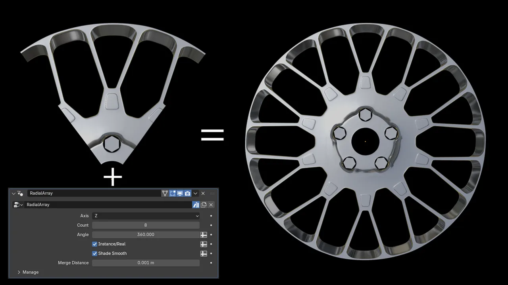
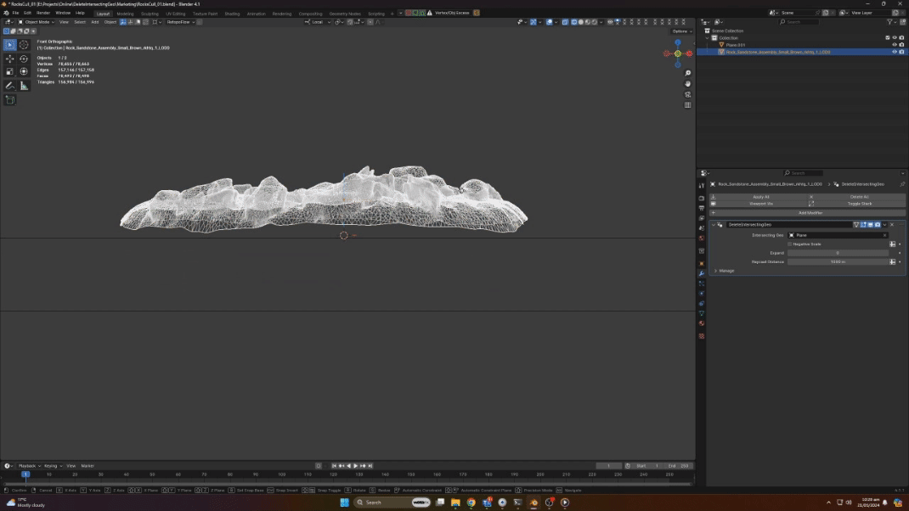
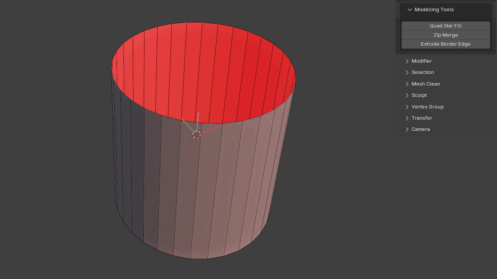
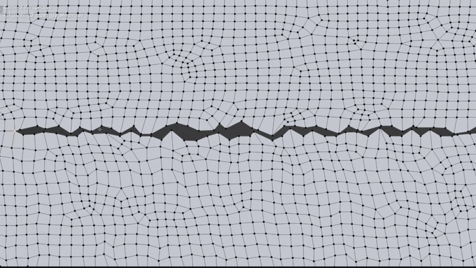
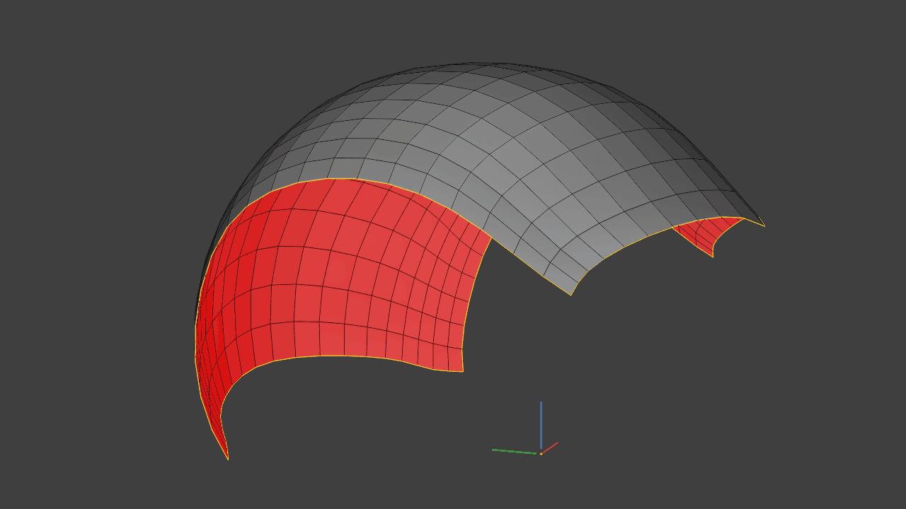

# Modelling

Geometry creation and editing tools for common modelling workflows.

## Radial Array

Creates a Geometry Nodes-based radial array modifier.

Rather than relying on instances distributed around a circle, the array is based on rotating geometry around the object's origin.

{ .media-center .media-medium }

## Delete Intersecting Geo

Creates a Geometry Nodes modifier that deletes geometry intersecting another object.

The affected area can be expanded or contracted, making it useful for environment work where hidden or unnecessary intersecting geometry needs to be culled.

{ .media-center .media-medium }

## Quad Star Fill

Fills a hole with a quad star.

{ .media-center .media-medium }

## Zip Merge

Designed for merging complex geometry when Merge by Distance creates problems, or when UVs need to be preserved without bridging faces.

A useful example is merging seams together on clothing.

{ .media-center .media-medium }

  <iframe
    src="https://www.youtube.com/embed/RVT4jkV888s"
    title="Zip Merge"
    style="position: absolute; top: 0; left: 0; width: 100%; height: 100%; border: 0;"
    allow="accelerometer; autoplay; clipboard-write; encrypted-media; gyroscope; picture-in-picture; web-share"
    allowfullscreen>
  </iframe>

## Extrude Border Edge

Extrudes and rotates selected border edges in Blender 5.2+.

{ .media-center .media-medium }
