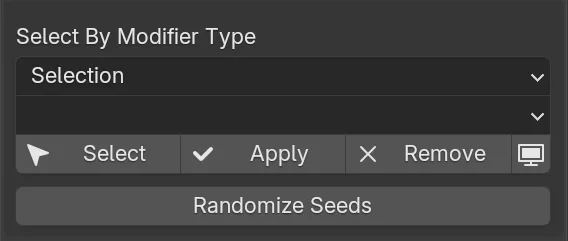

# Modifier

Utilities for managing modifiers across objects.

## Select By Modifier Type

Select, apply, remove or disable modifiers based on modifier type.

The search can be limited to:

- the entire scene
- the current selection

Modifiers can also be applied on instances.

{ .media-center .media-medium }

## Randomize Seeds

Randomizes exposed seed parameters on Geometry Nodes modifiers.

This is useful when the same procedural modifier is used across many objects and each object needs a different randomized result.
