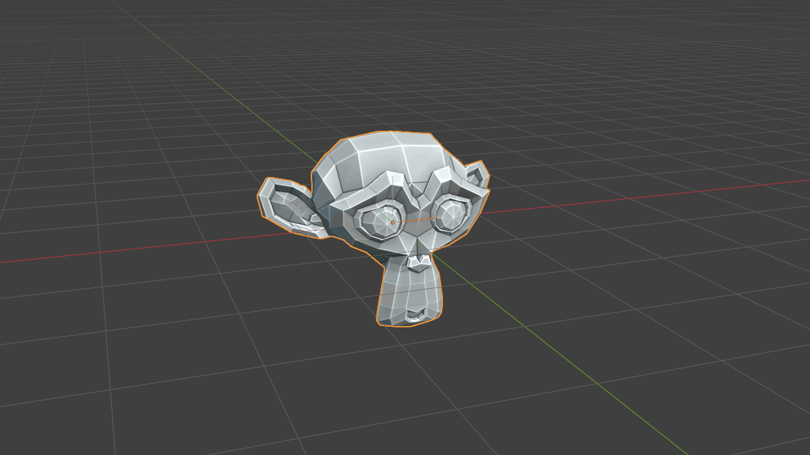
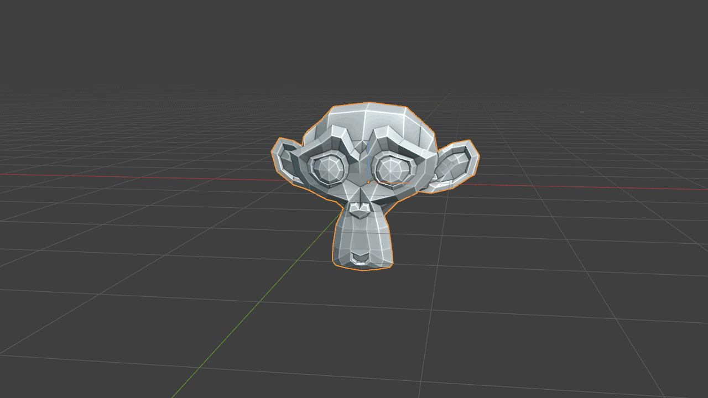

# Navigation

Viewport-aware transform tools designed for fast object manipulation.

## VP Step Rotate 45/-45

Assign a hotkey to quickly rotate selected objects by 45 degrees around the local axis that best aligns with the camera.

A useful personal mapping is **Ctrl + Shift + Mouse Wheel**.

{ .media-center .media-medium }

## VP Planar Move

Automatically locks the local axis facing the camera and moves objects along the other two axes. Hold G for 0.3 seconds to activate.

The tool supports multiple selected objects and is designed to be assigned to a hotkey for quick access.

{ .media-center .media-medium }
