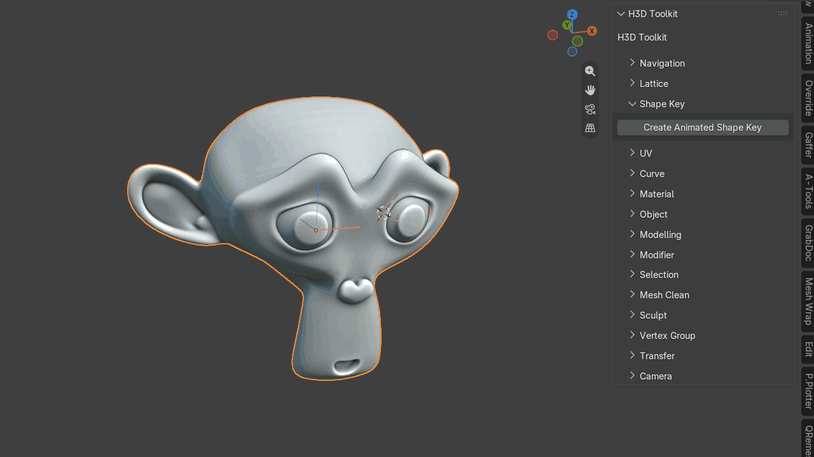

# Shape Key

## Create Animated Shape Key

Automatically creates a shape key on all selected objects and sets keyframes so the shape key can blend back and forth over time.

{ .media-center .media-medium }
