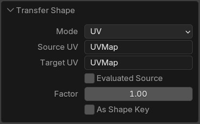
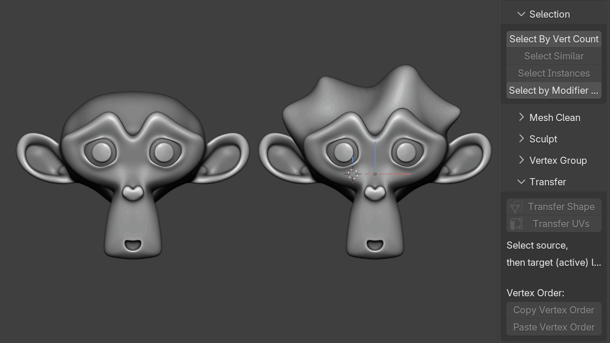
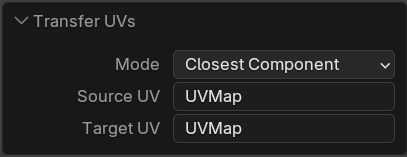
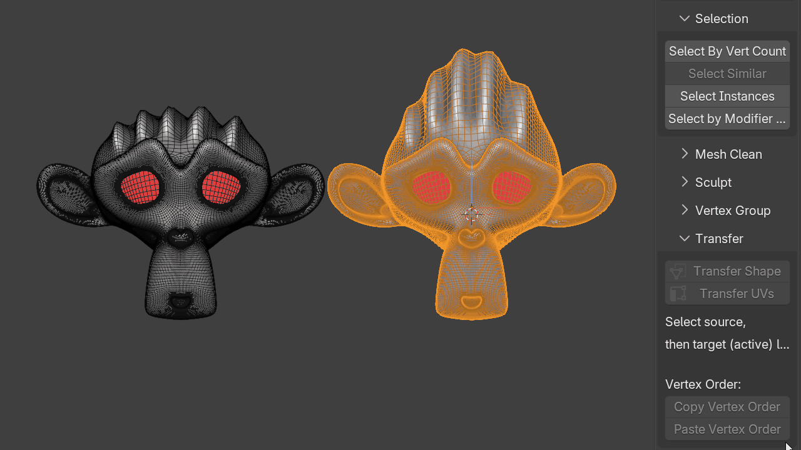

# Transfer

Utilities for transferring mesh data between source and target objects.

## Transfer Shape

Select a source mesh and then a target mesh.

Shape can be transferred using either:

- UVs
- vertex order

{ .media-center .media-medium }

{ .media-center .media-medium }

## Transfer UVs

Select a source mesh and then a target mesh.

UVs can be transferred using:

- vertex order
- closest component
- interpolated faces

{ .media-center .media-medium }

## Copy/Paste Vertex Order

Select two faces to copy and paste vertex order.

{ .media-center .media-medium }
