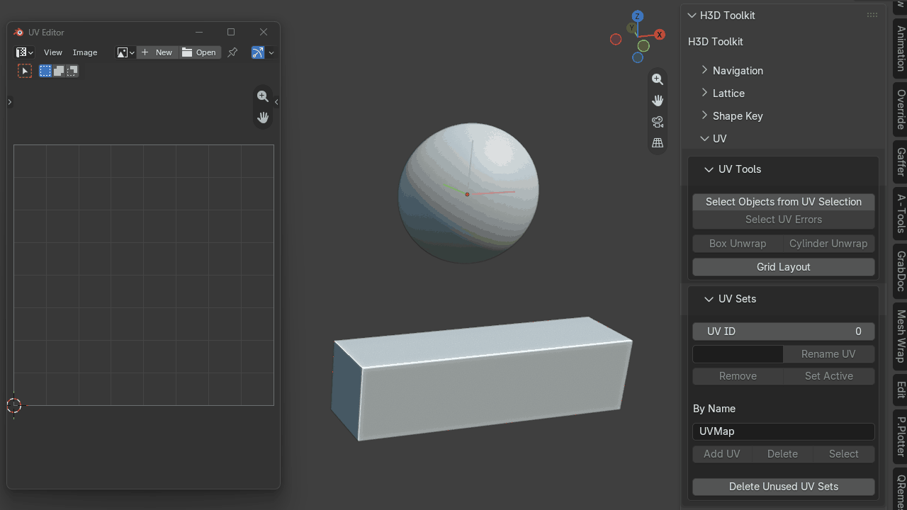
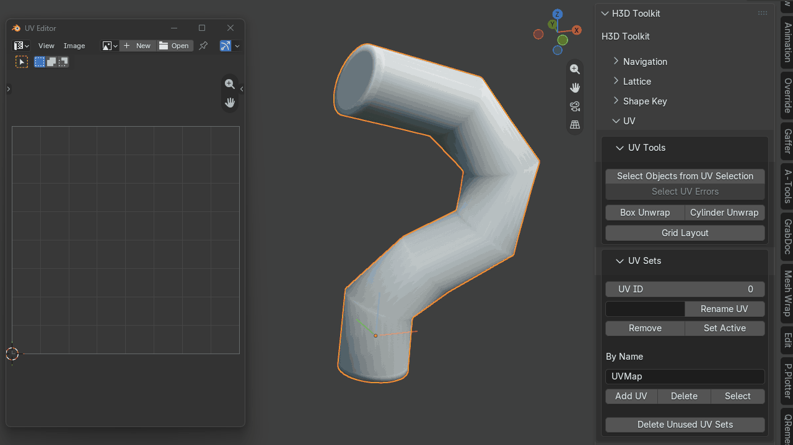
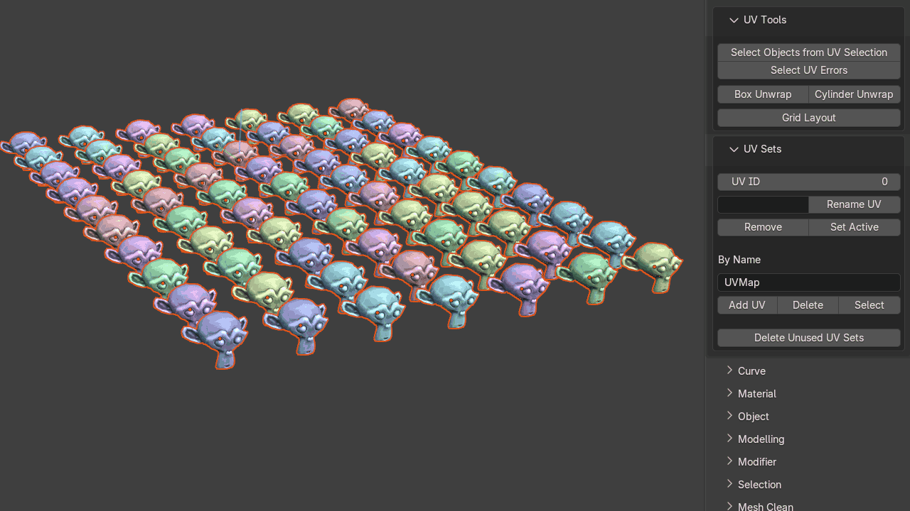
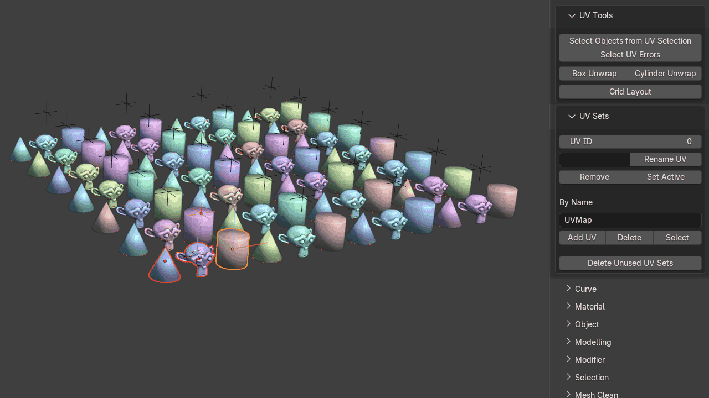

# UV

Utilities for UV cleanup, debugging, error detection and fast unwrapping.

## Delete Non-Active UV Set

Removes all UV sets except the currently active UV set.

This is useful after a large UV layout when geometry has accidentally been unwrapped across multiple UV sets and you want to collapse the scene back down to a single active set.

## Select Objects From UV Selection

A UV debugging utility that lets you quickly isolate and inspect problematic geometry from a UV selection.

Because visualizing UVs often requires the whole model to be in Edit Mode, this tool helps identify the objects associated with the selected UVs.

## Select UV Errors

A combined UV error checker that can detect:

- zero-length edges
- degenerate UVs
- overlapping UVs
- stretching
- UDIM crossing
- proximity to UDIM borders

## Box Unwrap

Automatically cuts seams and unwraps cube-like topology.

The tool can bias seams away from the camera-facing side and aims to keep the result as a single UV island. It also detects whether the topology is manifold or non-manifold and adjusts seam cutting accordingly.

{ .media-center .media-medium }

## Cylinder Unwrap

Cuts seams and unfolds cylinder-like topology.

The main quad body is straightened into a clean rectangular UV grid while the caps are left untouched. It can also hide the seam based on the current camera/view angle when the tool is run.

{ .media-center .media-medium }

## Grid Layout

Preserves repeating-object UVs and arranges them into a clean layout.

It creates vertical columns of stacked UVs, then moves horizontally to begin another column when capacity is reached. If the objects exceed one UDIM tile, layout continues into the next UDIM.

Works with both object and group selections.

**Object layout**

{ .media-center .media-medium }

**Group layout**

{ .media-center .media-medium }

[View Grid Layout on Superhive](https://superhivemarket.com/products/stack-unstack-uvs-udims-supported)

## UV Set Tools

Multi-object UV set utilities for:

- renaming UV sets
- deleting UV sets
- setting the active UV set
- creating UV sets
- adding UV sets 
- selecting UV sets by name
- deleting UV sets by name 

{ .media-center .media-medium }
